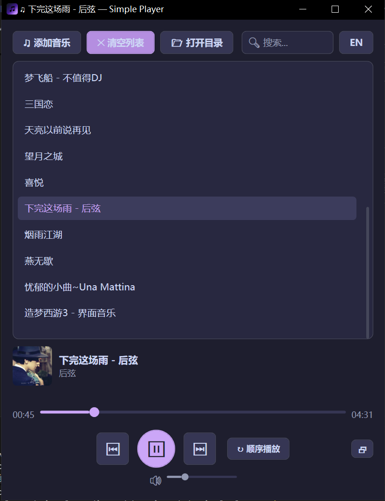

<div align="center">

# 🎵 SimplePlayer

**A lightweight, modern local music player built with C# and WPF.**

一款轻量、现代的本地音乐播放器，使用 C# 和 WPF 构建。




</div>

---

## ✨ Features

- 🎶 **Audio Format Support** — MP3, WAV, FLAC playback via Windows MediaPlayer
- 📂 **Drag & Drop** — Drag files or entire folders directly into the playlist
- 🏷️ **ID3 Metadata & Cover Art** — Reads song title, artist, and album art via TagLib-Sharp
- 📝 **LRC Lyrics Display** — Synced lyrics parsing and real-time display
- 🔍 **Playlist Search** — Instantly filter songs by keyword
- 🖥️ **System Tray** — Minimize to tray with background playback; double-click to restore
- ⌨️ **Keyboard Shortcuts** — Space (play/pause), Arrow keys (seek/volume), works globally
- 🎹 **Media Key Support** — Responds to hardware media keys (Play/Pause, Next, Previous, Stop)
- 🔁 **Playback Modes** — Sequential, Shuffle, and Single Loop
- 🔊 **Volume Control** — Slider + keyboard shortcuts with click-to-seek
- 💾 **Data Persistence** — Playlist, volume, play mode, and language preference auto-saved
- 🌐 **Bilingual UI** — Chinese / English toggle with one click
- 🎨 **Modern Dark Theme** — Catppuccin-inspired color palette with custom-styled controls

## 🛠️ Tech Stack

| Component | Technology |
|-----------|-----------|
| Language | C# 12 |
| UI Framework | WPF (Windows Presentation Foundation) |
| Runtime | .NET 8.0 (Windows) |
| Metadata | [TagLib-Sharp](https://github.com/mono/taglib-sharp) |
| Tray Icon | Windows Forms NotifyIcon |

## 🚀 Getting Started

### Prerequisites

- [.NET 8.0 SDK](https://dotnet.microsoft.com/download/dotnet/8.0) or later
- Windows 10 / 11

### Build & Run

```bash
# Clone the repository
git clone https://github.com/yanghuiloong/TheSimplePlayer.git
cd TheSimplePlayer

# Build the project
dotnet build

# Run the application
dotnet run
```

Or open `SimplePlayer.csproj` in **Visual Studio 2022** and press `F5`.

### ⌨️ Keyboard Shortcuts

| Key | Action |
|-----|--------|
| `Space` | Play / Pause |
| `←` | Seek backward 5s |
| `→` | Seek forward 5s |
| `↑` | Volume up 10% |
| `↓` | Volume down 10% |
| Media Keys | Play/Pause, Next, Previous, Stop |

## 📁 Project Structure

```
TheSimplePlayer/
├── App.xaml / App.xaml.cs          # Application entry point
├── MainWindow.xaml                 # UI layout (XAML)
├── MainWindow.xaml.cs              # UI logic (code-behind)
├── PlayerConfig.cs                 # Config data model for JSON persistence
├── Lang/
│   ├── zh-CN.xaml                  # Chinese language resources
│   └── en-US.xaml                  # English language resources
├── app_icon.ico                    # Application icon
└── SimplePlayer.csproj             # Project configuration
```

## 📄 License

This project is licensed under the [MIT License](LICENSE).

---

<div align="center">

# 🎵 SimplePlayer（简体中文）

</div>

## ✨ 功能特性

- 🎶 **音频格式支持** — 支持 MP3、WAV、FLAC 播放
- 📂 **拖拽导入** — 直接将文件或文件夹拖入播放列表
- 🏷️ **ID3 元数据与封面** — 通过 TagLib-Sharp 读取歌曲标题、艺术家和专辑封面
- 📝 **LRC 歌词显示** — 同步歌词解析与实时显示
- 🔍 **播放列表搜索** — 按关键词即时筛选歌曲
- 🖥️ **系统托盘** — 最小化到托盘后台播放，双击图标恢复窗口
- ⌨️ **键盘快捷键** — 空格（播放/暂停）、方向键（快进/音量），全局可用
- 🎹 **媒体键支持** — 响应硬件媒体键（播放/暂停、下一首、上一首、停止）
- 🔁 **播放模式** — 顺序播放、随机播放、单曲循环
- 🔊 **音量控制** — 滑块 + 键盘快捷键，支持点击跳转
- 💾 **数据持久化** — 播放列表、音量、播放模式和语言偏好自动保存
- 🌐 **中英双语界面** — 一键切换中文/英文
- 🎨 **现代深色主题** — Catppuccin 风格配色方案，自定义控件样式

## 🛠️ 技术栈

| 组件 | 技术 |
|------|------|
| 编程语言 | C# 12 |
| UI 框架 | WPF (Windows Presentation Foundation) |
| 运行时 | .NET 8.0 (Windows) |
| 元数据解析 | [TagLib-Sharp](https://github.com/mono/taglib-sharp) |
| 托盘图标 | Windows Forms NotifyIcon |

## 🚀 快速开始

### 环境要求

- [.NET 8.0 SDK](https://dotnet.microsoft.com/download/dotnet/8.0) 或更高版本
- Windows 10 / 11

### 构建与运行

```bash
# 克隆仓库
git clone https://github.com/yanghuiloong/TheSimplePlayer.git
cd TheSimplePlayer

# 构建项目
dotnet build

# 运行应用
dotnet run
```

或使用 **Visual Studio 2022** 打开 `SimplePlayer.csproj`，按 `F5` 运行。

### ⌨️ 快捷键

| 按键 | 功能 |
|------|------|
| `空格` | 播放 / 暂停 |
| `←` | 后退 5 秒 |
| `→` | 前进 5 秒 |
| `↑` | 音量增加 10% |
| `↓` | 音量减少 10% |
| 媒体键 | 播放/暂停、下一首、上一首、停止 |

## 📄 许可证

本项目基于 [MIT 许可证](LICENSE) 开源。
